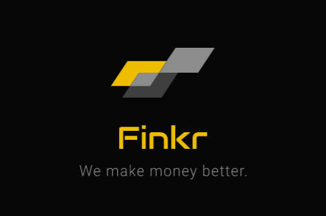

# 
<br/>

[](https://opensource.org/licenses/mit-license.php)
[](http://badge.fury.io/gh/boennemann%2Fbadges)
[](https://github.com/praneshn99/hm19_BigO)
[](https://github.com/praneshn99/hm19_BigO)


## Competition: HackMSIT 2k19

## TEAM NAME: BigO

## TEAM MEMBERS:
  
  1. Adisakshya Chauhan
  2. Avikant Wadhwa
  3. Pranesh Negi
  4. Rachnit Singh Jonty

# Instruction of Use: 


### Step 1:

In the master folder run
```
node server.js
```
This will activate the server on an available port

### Step 2:

Open browser window and in URL bar type
```
localhost:(port_number)
```
and with this you are now on Home Page of Finkr application.

### Step 3: (Using Finkr Form)

Enter your current investment details in the first 4 fields to let Finkr know about your current investment plans.
Enter your expected returns details in next 5 fields to let Finkr compute best possible suggestions for investments options for you.

### Step 4: (Output)

Finkr now will present the output in the console featuring all possible investment options for the user.

# NOTE:

Presently this is a prototype (working) depicting the picture of what Finkr is.
Hence whole functionality has not been completely implemented and so Finkr presently will show investment options in mutual funds only.

# FUTURE IMROVEMENTS:

Transforming this prototype into a full fledge application on cloud is our main motive and we will be looking forward in making it happen.
We will introduce many other investment options like:
  1. Gold
  2. PPF
  3. Fixed Deposits
  4. Cryptocurreny
  and many more popular investment options

We will build/encoprate various API's that will be used to fetch real time interest rates of various policies of different banks in India, to provide latest return policy to the user.

We will host the application on Heroku Cloud as free and open to all.
